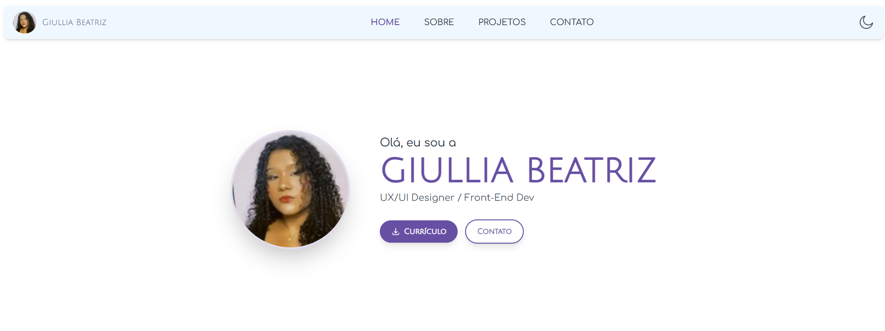
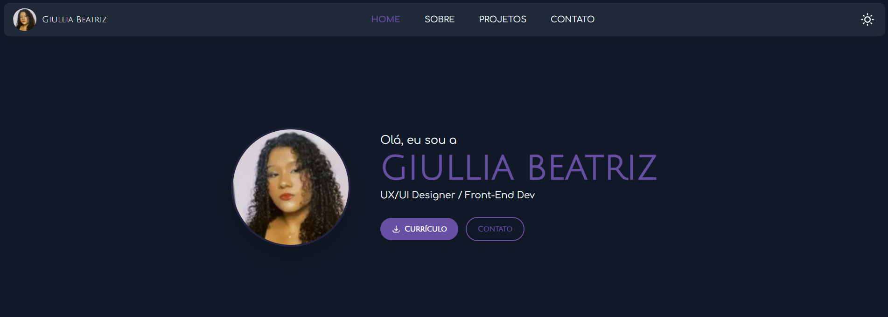

# 🎨 Portfólio Pessoal - Giullia Beatriz




## 🚀 Sobre o Projeto

Bem-vindo(a) ao repositório do meu portfólio pessoal! Este é o meu espaço na web para apresentar minha jornada, habilidades e projetos como UX/UI Designer e Desenvolvedora Front-End. O site foi projetado e desenvolvido do zero, com foco em criar uma experiência de usuário limpa, moderna, acessível e totalmente responsiva.

**➡️ Visite a versão online:** **[https://portfolio-iota-ivory-73.vercel.app/]**

---

## ✨ Funcionalidades Principais

* **Design System Customizado:** Cores, fontes e espaçamentos definidos com Tailwind CSS para garantir consistência visual.
* **Tema Dark/Light:** Toggle de tema para preferência do usuário, com transições suaves.
* **Totalmente Responsivo:** Layout adaptado para uma experiência perfeita em desktops, tablets e celulares.
* **Animações e Transições:** Micro-interações e animações que tornam a navegação mais fluida e agradável.
* **Componentização com React:** Estrutura organizada com componentes reutilizáveis para cada seção.
* **Carrosséis Interativos:** Uso da biblioteca Swiper.js para exibir projetos e tecnologias de forma dinâmica.
* **Formulário de Contato Funcional:** Integrado com o serviço [Formspree](https://formspree.io/) para recebimento de mensagens por e-mail.

---

## 🛠️ Tecnologias e Ferramentas

Este projeto foi construído utilizando as seguintes tecnologias e ferramentas modernas:

* **Front-End:**
    * [React](https://react.dev/) (com [Vite](https://vitejs.dev/))
    * [Tailwind CSS](https://tailwindcss.com/)
    * [React Router DOM](https://reactrouter.com/)
* **Bibliotecas:**
    * [Swiper.js](https://swiperjs.com/)
    * [Font Awesome](https://fontawesome.com/)
* **Design:**
    * [Figma](https://www.figma.com/)
* **Deploy:**
    * [Vercel](https://vercel.com/)

---

## ⚙️ Como Executar o Projeto Localmente

Para rodar este projeto no seu ambiente de desenvolvimento, siga os passos abaixo.

### Pré-requisitos

* [Node.js](https://nodejs.org/) (versão 18 ou superior)
* [Git](https://git-scm.com/)

### Passos

1.  **Clone o repositório:**
    ```bash
    git clone [https://github.com/giulliabeatriz/seu-repositorio.git](https://github.com/giulliabeatriz/seu-repositorio.git)
    ```

2.  **Navegue até a pasta do projeto:**
    ```bash
    cd seu-repositorio
    ```

3.  **Instale as dependências:**
    ```bash
    npm install
    ```

4.  **Inicie o servidor de desenvolvimento:**
    ```bash
    npm run dev
    ```

5.  Abra [http://localhost:5173](http://localhost:5173) (ou a porta que aparecer no seu terminal) no seu navegador para ver o resultado.

---

## 👤 Contato

**Giullia Beatriz**

* **LinkedIn:** [https://linkedin.com/in/giullia-beatriz](https://linkedin.com/in/giullia-beatriz)
* **E-mail:** giulliabeatrizrsilva@gmail.com

---

## 📜 Licença

Este projeto está sob a licença MIT. Veja o arquivo [LICENSE](LICENSE) para mais detalhes.